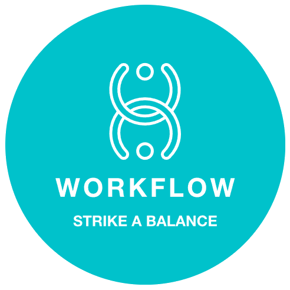

# Workflow

## Description

Workflow, a productivity application with a focus on work/life balance, presents a comprehensive dashboard equipped with customizable widgets catering to various functionalities. Users can seamlessly integrate essential tools such as clocks, calendars, file managers, schedules, and kanban boards into their workflow. The app's practicality is enhanced through versatile features like sticky notes, a notepad, and built-in tips for maintaining a healthy work/life equilibrium.

Workflow prioritizes user customization with adaptable color schemes, providing a personalized interface. The app's Progressive Web App (PWA) capabilities ensure accessibility across devices. Beyond its core productivity tools, Workflow promotes a balanced lifestyle by incorporating features like meditation tracks and inspirational quotes. The inclusion of chat and video chat functionalities further facilitates efficient collaboration within the application. Embrace efficiency and balance in your routine with Workflow's sleek design and practical features.

## Table of Contents

- [Features](#features)
- [Installation](#installation)
- [Usage](#usage)
- [Credits](#credits)
- [Contribute](#contribute)
- [Future Additions](#future-additions)
- [License](#license)
- [Contact](#contact)
- [Support Us](#support-us)

## Features

- User dashboard with draggable, customizable widgets:
    - Clock
    - Calendar
    - Daily Schedule
    - File Manager
    - Sticky Notes
    - Kanban (Project) Board
    - Meditation Tracks
    - Inspirational Quotes
    - Work/Life Balance Tips
    - Notepad
- Video Chat
- Text Chat
- Four color schemes to choose from
- Option to remove/add widgets as desired

## Installation

Access the app directly through [here](<https://workflow-oj8s.onrender.com/>). A local version can be installed by clicking the "install" icon at the right end of your address bar (in Google Chrome).

## Usage

Once logged in to the application, all widgets are accessible through the main dashboard (Widgets can be added and removed at the Settings page). Video chat and text chat functionalities are accessed via the sidenav bar (burger menu at top left corner). Color schemes can be changed through the Setting page.

## Credits

- Agora Video Chat
    - <https://docs.agora.io/en/video-calling/get-started/get-started-uikit?platform=web#display-the-user-interface>

- Inspiring Quotes
    - <https://www.lollydaskal.com/leadership/100-motivational-quotes-that-will-relieve-your-stress/>
    - <https://teambuilding.com/blog/work-life-balance-quotes>;

- Balance Tips
    - <https://www.smartsheet.com/content/how-to-improve-work-life-balance>
    - <https://www.kantata.com/blog/article/13-tips-tricks-to-maintain-a-healthy-work-life-balance>
    - <https://www.businessnewsdaily.com/5244-improve-work-life-balance-today.html>

- Meditation Music
    - <http://pixabay.com>

## Contribute

Feel free to fork this repository, check our [current issues page](<https://github.com/project3-team3/workflow-app/issues>) or contact us to request/propose new features.

## Future Additions

- New Widgets
    - Weather
    - Calculator
    - Pomodoro Timer
    - Nature Sounds/Soundscapes
    - Art Display
- Intro Tutorial
- Text formatting capabilities on Notepad Widget
- Playable audio tracks while visiting other sections
- Editable Kanban tasks
- Expandable/Single page Widgets
- More color schemes
- Customizable fonts
- Inbox/Notification Center

## License

This project is licensed under the [MIT](/LICENSE) License.

## Contact

This project was created by the [Workflow Team](<https://github.com/project3-team3>) ([Chris Godinho](<https://github.com/chris-godinho>), [Katrina Sarmiento](<https://github.com/KitSarmiento>), [Yves Harry Deslouches](<https://github.com/YvesHarry>) and [Junior Poku](<https://github.com/Junya-jp>)).

## Support Us

If you enjoy Workflow and its functionalities, please consider buying us a herbal tea [here](<https://donate.stripe.com/00gaEI7Dsakm8ZWbII>). You can also :star: star our project here on GitHub.